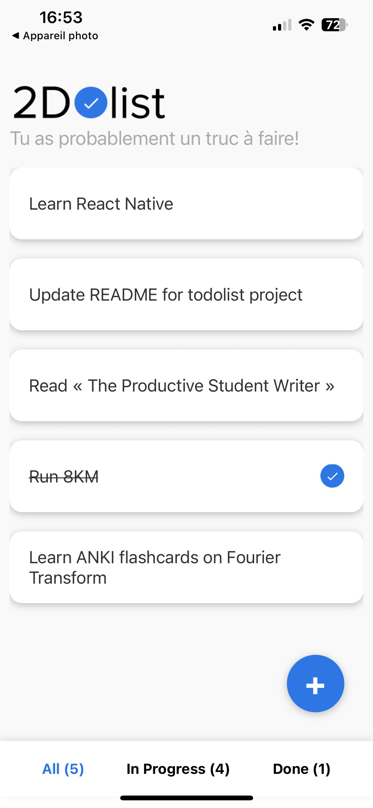
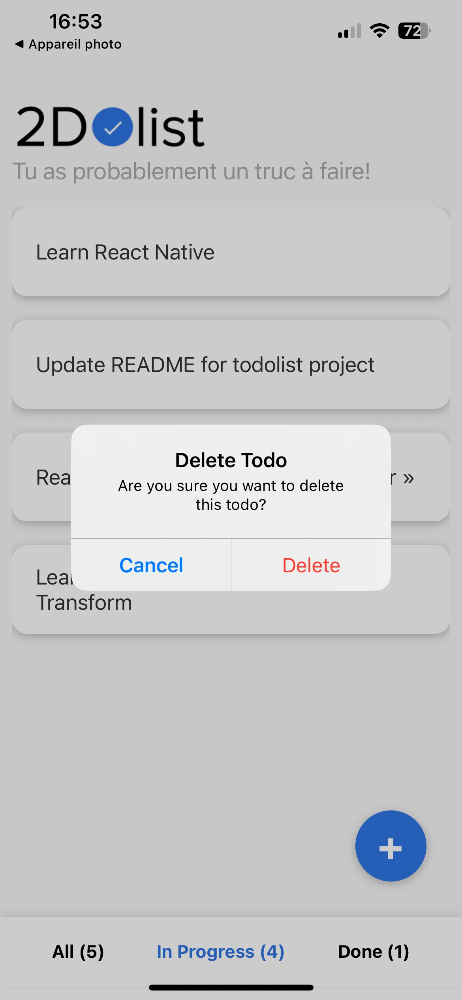

# Todo List — React Native (Intermediate)

This is a simple **Todo List** mobile app built with React Native and Expo.
This project is the second, slightly more intermediate app built while following the Udemy course:
[https://www.udemy.com/course/react-native-le-guide-du-debutant/](https://www.udemy.com/course/react-native-le-guide-du-debutant/)

## 🖼️ Screenshots

<p align="center">
  
  &nbsp;&nbsp;&nbsp;
  
</p>

_Manage tasks: add, delete, toggle and filter._

## 🚀 Getting Started

### Prerequisites

- Node.js installed
- Expo CLI (you can install it via `npm install -g expo-cli`)
- A device or simulator/emulator to run the app

### Installation

1. Clone this repository

2. Install dependencies

```bash
npm install
# or
yarn install
```

3. Start the app using Expo

```bash
npx expo start
```

Then follow the instructions (scan the QR code with Expo Go app, or run on iOS/Android simulator).

## 🧪 What’s inside

- A main screen showing the todo list and input to add items
- Ability to add, delete and toggle todos
- Filters and counts for All / Active / Completed
- Persistent storage using AsyncStorage
- Simple, clear UI with a header, todo cards and a bottom tab menu

## 🛠️ Built with

- React Native
- Expo (managed workflow)
- AsyncStorage
- JavaScript (ES6+)

## 🎯 Learning Goals

- Practice state management and component composition
- Learn navigation and persistence in React Native
- Build a small but functional mobile app
